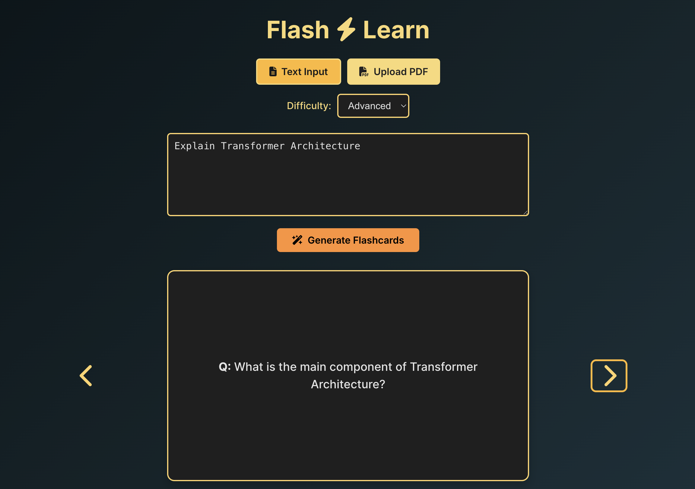

## ✨ About the Project: Flash⚡️Learn  
**Tagline:** *From learning to revising — all in a flash.*

---

### 🚀 Inspiration

The idea for Flash⚡️Learn came from a real-world problem — revisiting your own work before an interview or exam. Imagine having to quickly brush up on a project you completed months ago. Reading lengthy reports or notes isn’t practical when time is short. What truly helps is **answering flashcard-style questions**, which let you absorb the core concepts and refresh your memory fast.

We also saw an opportunity to help **learn new topics** on-the-go. Whether it's brushing up on machine learning, DevOps, or even world history — why not get the key takeaways instantly in a flashcard format?

Flash⚡️Learn was born from this dual need:  
**Revisit old knowledge or learn something new — instantly.**

---

### 💡 What it does

Flash⚡️Learn is an AI-powered flashcard generator that offers two core modes:

1. **Revise from your notes or documents** — Upload a PDF or paste your notes, and Flash⚡️Learn will instantly generate intelligent flashcards to help you recall key points.

2. **Learn a brand-new topic** — Just enter a topic like “Blockchain” or “Kubernetes” and get AI-generated Q&A flashcards to quickly get up to speed.

All flashcards are beautifully presented with a flip-card UI for smooth, interactive studying.

---

### 🛠️ How we built it

- **Frontend:**  
  Built with **React + Vite**, styled using **Tailwind CSS**, and enhanced with **Font Awesome icons** for a modern and accessible UI. Interactive flip-cards provide an intuitive flashcard experience.

- **Backend:**  
  Developed using **FastAPI (Python)**.  
  - PDF files are processed using **PyPDF2** to extract raw text.  
  - The text or user-given topic is sent to **OpenAI’s GPT API**, which returns flashcards in structured JSON format.

- **APIs & Integration:**  
  - **OpenAI GPT-3.5 Turbo** (for generating flashcards)  
  - **Render** is used to host and deploy the backend server.

---

### 🧩 Challenges we ran into

- **Crafting the right prompt:**  
  Getting consistently structured and relevant output from the GPT API required careful prompt engineering.

- **PDF text extraction quirks:**  
  Not all documents are well-formatted, which made it challenging to extract clean, usable text.
  
- **GPT formatting inconsistencies:**
  Getting consistent JSON output from the GPT API was tricky. We had to parse and validate responses properly on the backend to ensure our frontend
  didn’t crash.

---

### 🏆 Accomplishments that we're proud of

- **Solving a real-life problem:**  
  We tackled a situation that many students and professionals face — revisiting knowledge efficiently — and delivered a practical solution.

- **Full-stack integration:**  
  Successfully connected frontend, backend, and AI into a smooth, end-to-end experience within a limited timeframe.

- **Dual-mode functionality:**  
  Supporting both learning and revision workflows while keeping the UI intuitive and clean.

---

### 📚 What we learned

- The importance of prompt design in LLM-based applications.
- Full-stack web app building with **React, Tailwind, FastAPI**, and external APIs.
- Deploying backend services using **Render**, and managing cross-origin frontend/backend communication.

---

### 🚀 What's next for Flash⚡️Learn

- Enable **editing and saving flashcards** to personalize learning.
- Introduce **user accounts and saved decks** to build a personal library.
- Optimize for **mobile** and add **offline access** for on-the-go revision.
- Recommend **related topics** and trending subjects for exploration.

---
